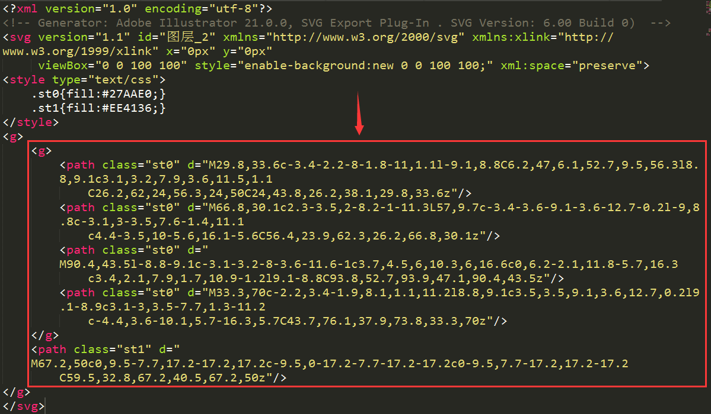
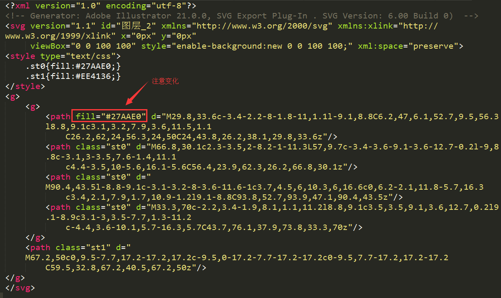

# logo定制

## 素材上传
* 后台上传 `svg` 图片，并 **保存图片地址**，同时 **提取svg图形代码**
|   id   |   url               |   svg  |
|--------|---------------------|--------|
|    1   | /uploads/logo/1.svg |   ...  |

* 提取方式 

 

 (注意，用`fill`替换对应的class)
 
 

## 接口
* 筛选logo展示列表
  * URL: `/api/logo/materialPreview?material_id=1&name=中润普达&slogan=hello word&nc=f00`
  * 入参(GET)
  ```javascript
  {
     material_id: 1,
     name: '中润普达',
     slogan: 'hello world',
     nc: 'f00'
  }
  ```
  * 返回 [参考](www.logofree.cn/openapi/logo/materialPreview?material_id=933&name=中润普达&slogan=)
  ```javascript
  <svg version="1.1" xmlns="http://www.w3.org/2000/svg" xmlns:xlink="http://www.w3.org/1999/xlink" x="0px" y="0px" width="100%" height="100%" viewBox="0 0 200 320" xml:space="preserve">
	<g id="svg-content">
		<g transform="matrix(0.70,0,0,0.70,30,40)">
        
        // here is svg code，from your database information
        // when get 'nc' value,you should change svg fill color
        
        </g>
        <text style="font-family:jianhei" letter-spacing="4" text-anchor="middle" fill="#3e3a39" stroke="#3e3a39" stroke-width="1" font-size="40" dx="100" dy="250">中润普达</text>
		<text style="font-family:jianhei" text-anchor="middle" fill="#888888" font-size="23" dx="100" dy="285"></text>
    </g>
  </svg>
  ```

* 编辑svg
 * URL: `/api/logo/svg`
 * 入参: `material_id`
 * 返回 [参考](http://www.logofree.cn/openapi/logo/svg?material_id=2072)
 ```javascript
 <svg version="1.1" id="svg-draw" xmlns="http://www.w3.org/2000/svg" xmlns:xlink="http://www.w3.org/1999/xlink" x="0px" y="0px" width="100%" height="100%" xml:space="preserve">
	<g id="svg-content">
		<g id="svg-logo" class="svg-element">
            // inject svg code from database
        </g>
		<g id="svg-name" class="svg-element"></g>
		<g id="svg-slogan" class="svg-element"></g>
		<g id="svg-atext" class="svg-element"></g>
	</g>
</svg>
 ```


***
by [jackLei](www.flowerboys.cn), BeiJing CHINA